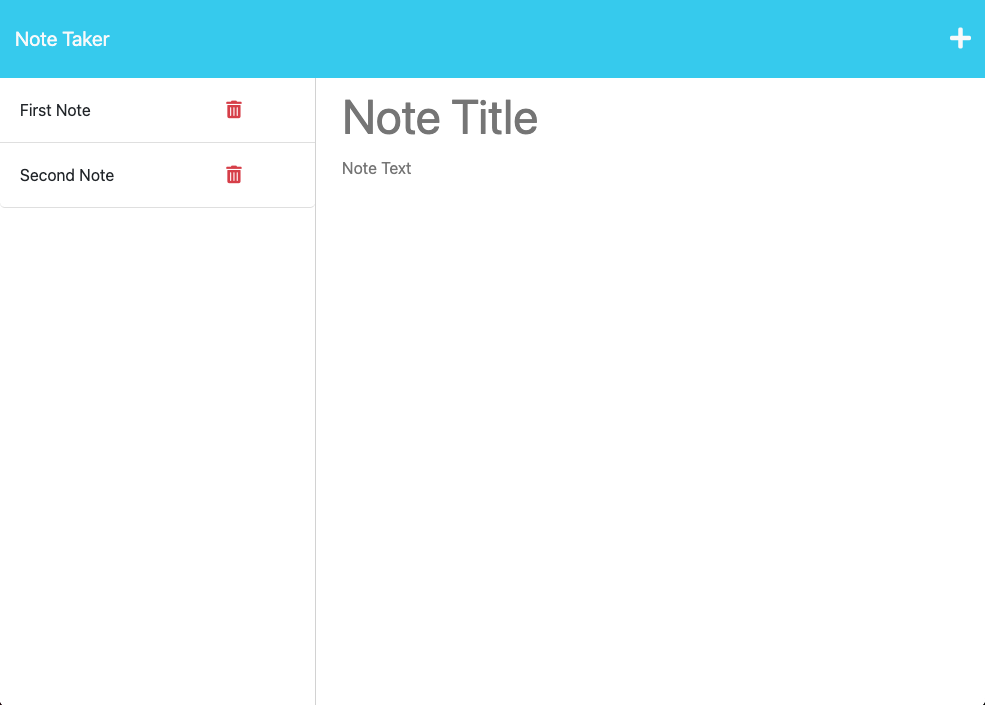
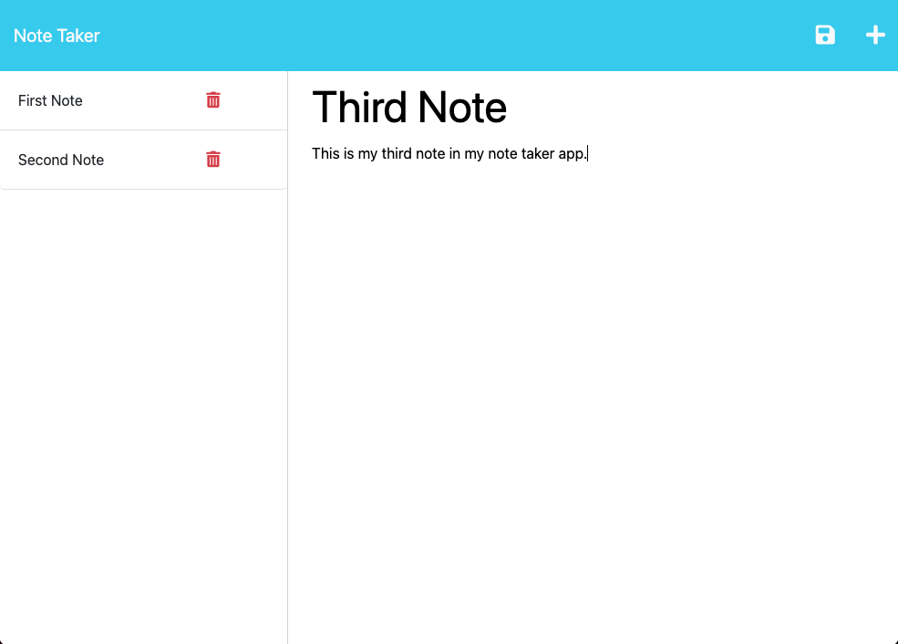

# Duly Noted

## Table of Contents

- [Description](#description)
- [License](#license)
- [Installation](#installation)
- [Usage](#usage)
- [Contributing](#contributing)
- [Tests](#test)
- [Questions](#questions)

## Description

Duly Noted is a note taker application that allows the user to enter a note title and text and save it to stay organized.

## Installation

Clone the repo. Download and install Node.js. Run the application from your code editor's terminal.

## Usage

Enter relevant text into the fields and click the save button that appears.

[Click here to view demonstration video](https://drive.google.com/file/d/1kEfrdvSlSwpeIjFeNdUBTe7-607x1ssY/view)

## License

This project uses MIT

[Click here to view license](https://opensource.org/licenses/MIT)

## Contributing

Clone the repo and/or contact me

## Tests

N/A

## Questions

- Author: Stevie Miller
- GitHub: [StevieMiller](https://github.com/StevieMiller)
- Email: stephanie.miller@carlsbadschools.net
